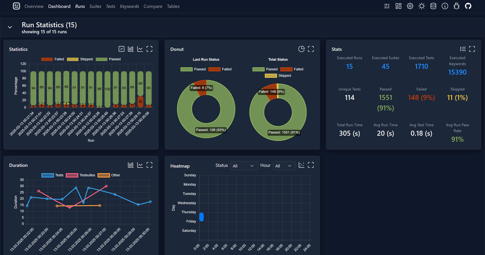

# 📊 Robot Framework Dashboard

[](https://pypi.org/project/robotframework-dashboard)
[](https://pepy.tech/projects/robotframework-dashboard)
[](https://pepy.tech/projects/robotframework-dashboard)
[](LICENSE)

Before reading anything else here is a [Fully Functioning Dashboard](https://timdegroot1996.github.io/robotframework-dashboard/example/robot_dashboard.html) you can checkout right away!

## 🎯 Overview

Robot Framework Dashboard is a tool for [Robot Framework](https://robotframework.org/) that provides insight of your test results across multiple runs. The tool makes use of the built in Robot Framework [Result Visitor API](https://robot-framework.readthedocs.io/en/stable/_modules/robot/result/visitor.html) to analyse output.xml files, stores these in a simple sqlite3 database and finally creates a HTML dashboard that makes use of [Chart.js](https://www.chartjs.org/docs/latest/) and [Datatables](https://datatables.net/) for the graphs and tables and makes use of [Bootstrap](https://getbootstrap.com/) for styling. Additionally [GridStack](https://gridstackjs.com/) is used for the interactive layout grids.



## 🚀 Getting Started
Install Robot Framework 6.0 or higher (if not already installed):
```
pip install robotframework
```
Install Robot Framework Dashboard:
```
pip install robotframework-dashboard
```

## 🔍 Key Features

- 🏃 **Multi-run Analysis** – Compare and track results across multiple Robot Framework test runs.  
- 🌐 **Interactive HTML Dashboard** – Fully interactive dashboard using Chart.js, Datatables, and GridStack.  
- 🗄️ **SQLite Database Storage** – Lightweight database for easy querying and persistent storage.  
- 📄 **Dashboard Pages** – Overview, Dashboard, and Compare pages for multi-level insights.  
- 🎛️ **Customizable Layouts** – Drag-and-drop sections with adjustable size and order.  
- 📊 **Graph Customization** – Toggle legends, axis titles, labels, and control animations.  
- 🔎 **Global Filters** – Filter runs by name, tags, date, metadata, or quantity.  
- ⚖️ **Comparison Mode** – Compare up to 4 runs side by side with visual statistics.  
- 🔗 **Automatic Log Linking** – Open Robot Framework logs directly from the dashboard.  
- 🛠️ **Custom Database Classes** – Extend or replace the database processor for custom backends.  
- 🖥️ **Server Mode** – Host your dashboard for multi-user access and automatic updates.  
- 🎧 **Listener Integration** – Automatically updates dashboard after every test run.  
- 📝 **Message Config Support** – Group similar test failures using regex-based patterns.  
- ⚙️ **Configurable Defaults** – Preload dashboard settings via JSON for consistent appearance.  

…and many more advanced features to help you visualize, analyze, and manage your Robot Framework test results with ease!

## 📖 Read the Docs
For detailed usage instructions, advanced examples, and full documentation, visit the docs: [Homepage](https://timdegroot1996.github.io/robotframework-dashboard/)

## 🔗 Quick Links
- [Installation](./docs/installation.md)
- [Version Compatibility](./docs/compatibility.md)
- [Command Line Interface](./docs/cli.md)
- [Dashboard Features](./docs/dashboard.md)
- [Advanced Usage & Examples](./docs/usage.md)
- [Custom Database Class](./docs/custom-database.md)
- [Dashboard Server & Listener](./docs/server.md)

## 🛠️ Contributing

Contributions are welcome! If you encounter any issues, have suggestions for improvements, or would like to add new features, feel free to open an issue or submit a pull request. Additional information can be found here in [Contributing](./contributing.md)

## 📋 License
This project is licensed under the MIT License.

> **Note:** This project is not officially affiliated with or endorsed by Robot Framework.
